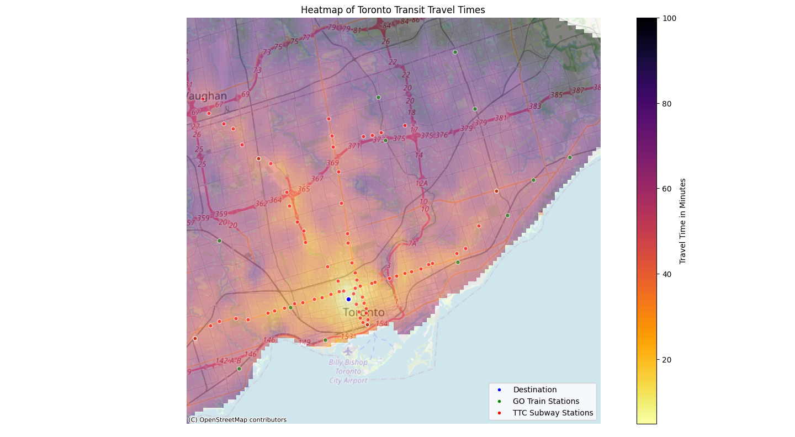

# Toronto Transit Heat Map

This repository contains the code for my data visualization project. Feel free to fork this code to modify the data visualization for Toronto, or use the code as an inspiration to do the same visualization for other cities.

## Example Results




## How to Run

### Data Gathering

In the repository, I have already provided some data in the form of json files under the `data` directory. However, you can also use the `get_data.py` script to gather your own data. You will require a Google Maps API key with the Directions API enabled. You'd want to add this to a `.env` file like this:

```SHELL
GOOGLE_MAPS_API_KEY=YOUR_API_KEY_HERE
```

You can also tweak the `gap` parameter of the `create_grid` function if you wish to have more precision in your data. **Note:** This will increase the amount of Google Maps API calls and thus the cost. You can change the `destination` parameter of the `calculate_time_to_travel` function to gather data about different destinations. You can also change the departure time by tweaking the `departure_time` parameter.

### Data Visualizing

You can use the `visualize.py` script to visualize your data. The data must be in JSON format similar to the `get_data.py` output. There are three parameters of the `create_interpolated_heatmap` function that you can tweak. The `resolution` parameter controls how smooth the heatmap will be. The `a_min` and `a_max` parameters can be used to set a minimum and maximum travel time displayed on the heatmap respectively. This allows you to minimize the effects of outliers. Remember to change the `destination` parameter of `plot_heatmap` function to plot the correct destination marker on the final heatmap.

